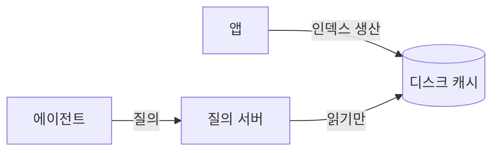

# 지식 질의 서버 계약

## 위치

앱이 세운 인덱스를 에이전트가 읽을 수 있게 내보낸다. 서버는 캐시를 읽기만 하고
인덱스를 만들지 않는다 — 생산자는 하나여야 한다.

## 도구

도구는 하나다. 구조 질의와 본문 검색을 한 번의 호출로 답한다.
같은 인자에 같은 결과를 낸다 — 모델도 키도 쓰지 않는다.

[[backlinks-query-design]] · [[stale-cache-signal]] 참조.
