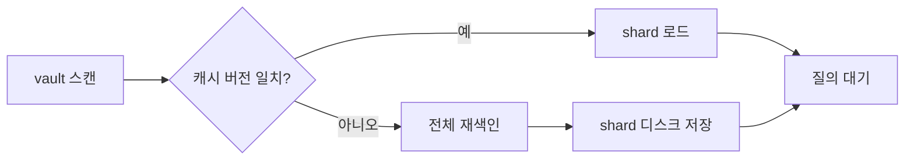

# 인덱스 재구축 전략

## 흐름

```mermaid
flowchart LR
  A[vault 스캔] --> B{캐시 버전 일치?}
  B -- 예 --> C[shard 로드]
  B -- 아니오 --> D[전체 재색인]
  D --> E[shard 디스크 저장]
  C --> F[질의 대기]
  E --> F
```

전체 재색인은 파일 트리 표시를 막지 않는다. 인덱스가 준비되기 전에도
노트를 열 수 있어야 한다. [[index-cache-invalidation]] 참조.
